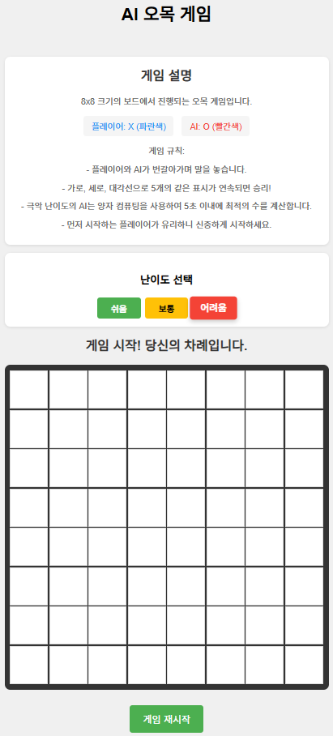
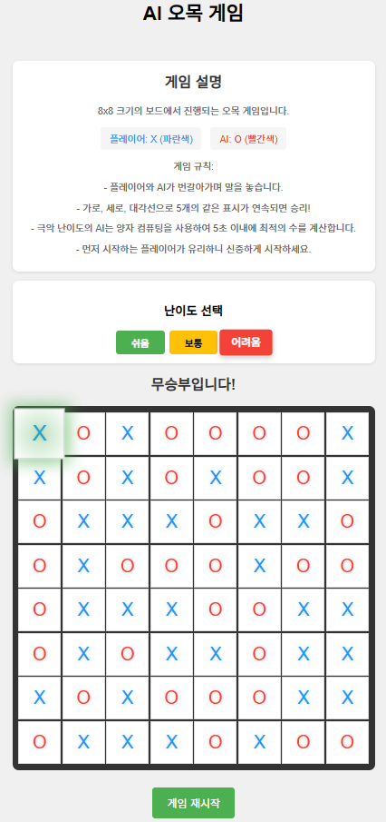
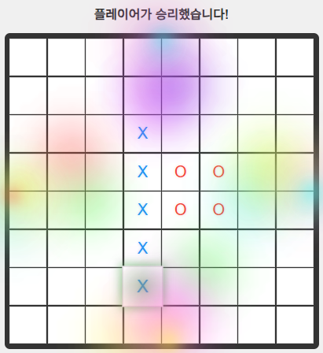

# 🎮 AI 오목 모바일 게임





## 🎯 게임 개요
HTML5와 JavaScript로 구현된 인공지능 오목 게임입니다. 플레이어는 AI와 대결하며, 다양한 난이도에서 도전할 수 있습니다. 특히 고급 AI는 실시간 게임 상황을 분석하여 동적으로 게임 보드를 확장하는 독특한 전략을 구사합니다.

## ✨ 주요 기능
- 🤖 3가지 난이도의 진화하는 AI 대전
  - 쉬움: 기본적인 전략과 80% 확률의 방어 능력
  - 보통: 중급 전략과 99% 확률의 정확한 방어
  - 어려움: 고급 전략, 동적 보드 확장, 양자 컴퓨팅 기반 의사결정
- 🎨 현대적인 UI/UX
  - 반응형 디자인
  - 부드러운 애니메이션
  - 직관적인 인터페이스
  - 마지막 수 하이라이트 효과
- 🎵 몰입감 있는 효과
  - 돌 놓는 효과음
  - 승리/패배 효과음
  - 승리 시 화려한 폭죽 애니메이션
- 📱 모바일 최적화
  - 터치 스크린 지원
  - 모바일 기기에서도 부드러운 플레이
- 🔄 동적 게임 보드
  - AI의 실시간 게임 상황 분석
  - 무승부 가능성에 따른 자동 보드 확장 (8x8 → 8x9)
  - 전략적 게임 플레이 공간 최적화

## 🎮 게임 규칙
- 기본 8x8 크기의 보드에서 시작
- 어려움 난이도에서 무승부 가능성 감지 시 보드 자동 확장
- 플레이어(X)와 AI(O)가 번갈아가며 돌을 놓음
- 가로, 세로, 대각선으로 5개의 같은 표시가 연속되면 승리
- 모든 칸이 채워지면 무승부 또는 보드 확장

## 🧠 AI 특징
- 실시간 게임 상황 분석
- 승리 가능성 계산 및 최적 수 선택
- 어려움 난이도의 특수 기능:
  - 무승부 확률 실시간 계산
  - 동적 보드 크기 조정
  - 고급 수비/공격 전략 구사

## 🚀 시작하기
1. 저장소 클론
```bash
git clone [저장소 URL]
```

2. 게임 실행
- `index.html` 파일을 웹 브라우저에서 열기
- 또는 GitHub Pages(https://h2aler.github.io/HTML5_AI_GAME_ONE_MOBILE/)
- 를 통해 온라인으로 플레이
  

## 🛠 기술 스택
- HTML5
- CSS3
- JavaScript (ES6+)
- 반응형 웹 디자인

## 📱 호환성
- 데스크톱 브라우저 (Chrome, Firefox, Safari, Edge)
- 모바일 브라우저 (iOS, Android)
- 태블릿 기기

## 🎨 디자인 특징
- 모던한 UI/UX
- 부드러운 애니메이션
- 직관적인 컨트롤
- 반응형 레이아웃
- 동적 보드 크기 조정 시 자연스러운 전환 효과
- 마지막 수 위치 하이라이트
- 승리 시 화려한 폭죽 효과

## 🎵 사운드 효과
- 돌 놓는 효과음
- 승리/패배 효과음
- 모든 효과음은 무료 라이센스 사용
- 사용자 상호작용 기반 오디오 최적화

## 🔧 성능 최적화
- 효율적인 게임 로직 처리
- 부드러운 애니메이션 렌더링
- 모바일 디바이스 배터리 소모 최적화
- 터치 이벤트 최적화

## 🤝 기여
버그 리포트나 기능 제안은 Issues 섹션을 통해 해주세요.
- 버그 수정
- 새로운 기능 제안
- UI/UX 개선 의견
- 성능 최적화 제안

## 🔄 업데이트 내역
### 최신 업데이트
- 동적 보드 크기 조정 기능 추가
- AI 난이도별 전략 개선
- UI/UX 개선 및 애니메이션 효과 추가
- 모바일 호환성 강화

### 예정된 업데이트
- 온라인 멀티플레이어 모드
- 게임 기록 저장 기능
- 추가 AI 난이도
- 커스텀 보드 크기 설정

# 📢 중요한 공지
## 📄 라이센스

모든 자료의 저작권은 **[H2aler(김재현: KIM JAEHYUN)]**에게 있으며,  
허가 없이 **복제, 배포, 전송, 전시** 등의 행위를 **금지**합니다.
